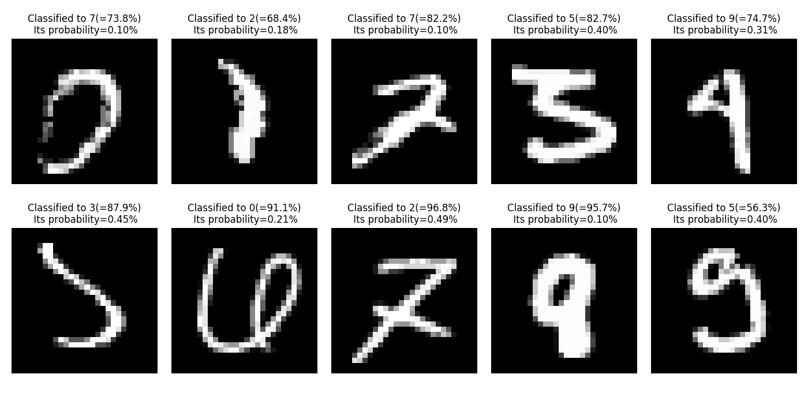

# Classifiers with CNNs in Keras
For better understanding Convolutional Neural Networks for classification tasks by implementing appropreate model using Keras.
Train on `MNIST` dataset from scrach, and also on `Dogs vs. Cats` dataset ([link](https://www.kaggle.com/c/dogs-vs-cats/data)) by adopting VGG19 model with weights pretrained on ImageNet dataset.  


### Environments
- macOS High Sierra 10.13.6 or Ubuntu 18.04 with Geforce GTX 1080
- Python 3.6.7
- Keras 2.3.0
- tensorflow(-gpu) 1.14.0 (backend)

In your pyenv environment, run 
```bash
$ pip install -r requirements.txt
```

### Prerequisites
Before training `dogs vs. cats`, you suppose to have the `dogs vs. cats` dataset (Otherwise download it from Kaggle [link](https://www.kaggle.com/c/dogs-vs-cats/data)).  
You can get ready to train by running:
```bash
# cd dogs-vs-cats/
$ python prepare_dataset.py --souce-dir #path to your folder where dataset exists.
```
**Note: this creates a folder for storing dogs vs. cats dataset as subdirectory of this repository.

## On MNIST dataset
Train CNN model by running,
```bash
# cd mnist/
$ python train_mnist.py -e 10 -b 32 --prefix Trial1
```
It gets around 99.47% test accuracy after 14 epoch.

### Training curves

*Note: [machine learning - Higher validation accuracy, than training accurracy using Tensorflow and Keras - Stack Overflow](https://stackoverflow.com/questions/43979449/higher-validation-accuracy-than-training-accurracy-using-tensorflow-and-keras)

### Normarized confusion matrix 


### Misclassified examples (picked the most often occurs one)




## On Dog vs. Cats dataset
Use VGG19 with weights pretrained ImageNet[^2] dataset as base model to extract features.  
Train classifier by running,
```bash
# cd dogs-vs-cats/
$ python train_dogs-vs-cats.py -e 10 -b 64 --prefix Trial1
```
**Note: I don't recommend you to set batch size too large. My pc suddenly shut down because PSU resource was not enough.  

It gets around 96.20% test accuracy after 27 epoch.

### Training curves


## References
1. [keras/mnist_cnn.py at master · keras-team/keras](https://github.com/keras-team/keras/blob/master/examples/mnist_cnn.py)

1. [Confusion matrix — scikit-learn 0.21.3 documentation](https://scikit-learn.org/stable/auto_examples/model_selection/plot_confusion_matrix.html#sphx-glr-auto-examples-model-selection-plot-confusion-matrix-py)

1. [Dogs vs. Cats | Kaggle](https://www.kaggle.com/c/dogs-vs-cats/)

1. [Image classification  |  TensorFlow Core](https://www.tensorflow.org/tutorials/images/classification)
